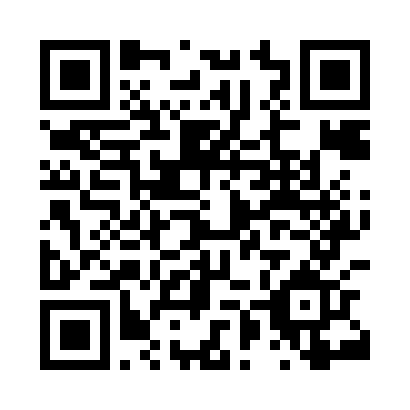

# 🏄 MétroSurf 🏄 - Civiclab 2023/2024

Ce dépôt contient le code de la plateforme réalisée dans le cadre du <a href="https://grenoble.civiclab.eu/">Civiclab 2023/2024</a>.

La plateforme a été conçue en premier lieu pour les smartphones. Vous pouvez **flasher ce QR** pour accéder à la plateforme :

Sur ordinateur, vous pouvez y accéder à cette adresse : https://civiclab.plbayart.fr/

## 📊 Données utilisées

La plateforme s'appuie sur une **base de données SQLite** qui contient des données issues de **3 sources différentes** :

- Fichier CSV de données historiques synthétisées

Ces données sont issues de différentes sources (<a href="https://www.irma-grenoble.com/">IRMA</a>, <a href="https://symbhi.fr/">SYMBHI</a>, ...)

- <a href="https://hubeau.eaufrance.fr/">L'API de Hub Eau</a>

Cette API permet de récupérer les **hauteurs** et les **débits d'eau** au niveau des stations de mesure (5 stations : <a href="https://www.vigicrues.gouv.fr/niv3-station.php?CdEntVigiCru=19&CdStationHydro=W141001001&GrdSerie=H&ZoomInitial=3">Station Grenoble [Bastille] (Isère)</a>, <a href="https://www.vigicrues.gouv.fr/niv3-station.php?CdEntVigiCru=19&CdStationHydro=W283201001&GrdSerie=H&ZoomInitial=3">Station Pont-de-Claix (Drac)</a>, <a href="https://www.vigicrues.gouv.fr/niv3-station.php?CdEntVigiCru=19&CdStationHydro=W141001201&GrdSerie=H&ZoomInitial=3">Station Domène (Ruisseau du Doménon)</a>, <a href="https://www.vigicrues.gouv.fr/niv3-station.php?CdEntVigiCru=19&CdStationHydro=W276721401&GrdSerie=H&ZoomInitial=3">Station Notre-Dame-de-Mésage (Romanche)</a> et <a href="https://www.vigicrues.gouv.fr/niv3-station.php?CdEntVigiCru=19&CdStationHydro=W276721102&GrdSerie=H&ZoomInitial=3">Station Livet-et-Gavet [Champeau] [DREAL] (Romanche)</a>).

- <a href="https://www.vigicrues.gouv.fr/rss/">Le flux RSS de Vigicrue</a>

Ce flux RSS contient les **niveaux de vigilance** Vigicrue par tronçon. Les données relatives aux 5 stations de mesure sont récupérées.

## 🍪 Cookies

La plateforme n'utilise que des **cookies nécessaires à son fonctionnement**. Il n'y a pas de **cookies de traçage publicitaires**.

## ⚙️ Technologies utilisées

En back-end :

- Django
- SQLite
- Gunicorn
- Nginx
- Docker
- Docker-compose

En front-end :

- LeafLet
- Bootstrap

## 🚀 Déploiement

La plateforme est **déployée** sur un serveur Ubuntu du datacenter d'**OVH à Gravelines** 🇫🇷  
